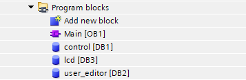
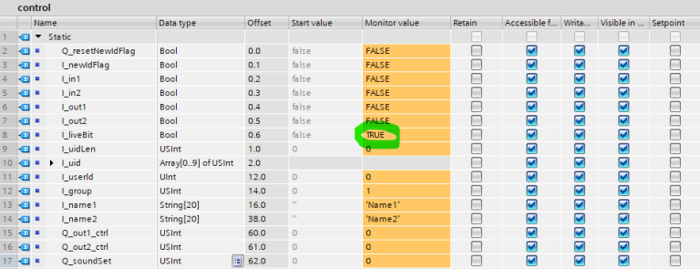
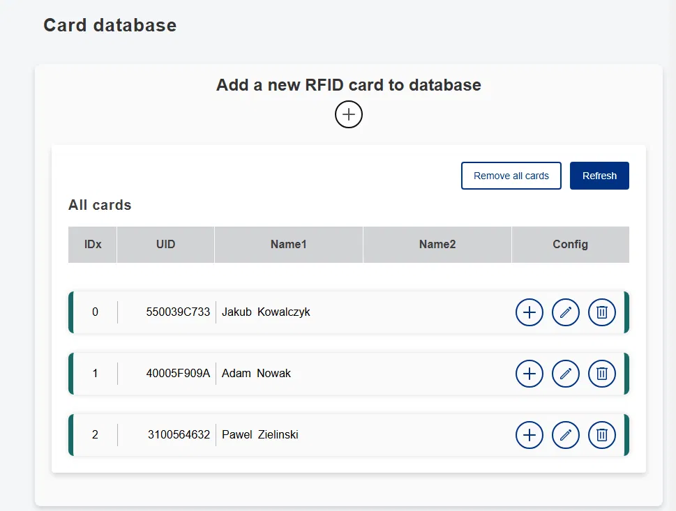
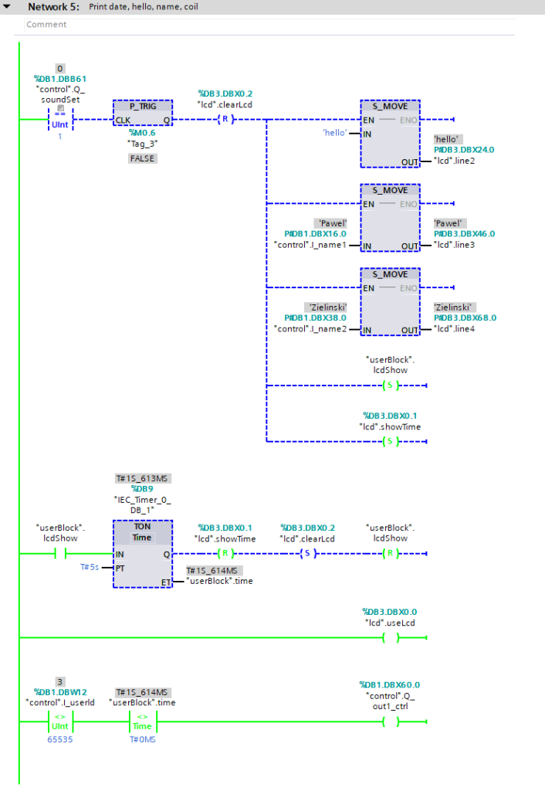

# **HOWTO #1**

# **How to integrate Siemens PLC S7-300/S7-1200/S7-1500 with RFID reader Inveo BoxID**

The repo is devided by:

- db files for 3 types of readers - depending to features that each reader consists
- function files for user administration and keyboard
- example Tia Portal project with all basic features integrated
  

**“S7 PLC configuration"**

This tutorial is intended to demonstrate the process of configuring the Inveo Box ID RFID reader with Siemens S7-300/S7-1200/S7-1500 controllers. 

We start by creating a new project and selecting a controller - this can be any controller from the S71200/S71500 family and some S7300 models. In our case, it will be a 1511-1 unit.

Ensure that the reader and the controller are on the same network.

In our case it will be:

*   S7-1500 - IP: 192.168.0.1
    
*   Inveo Box ID reader - IP: 192.168.0.2
    

To configure the network settings in the S7-1200/S7-1500 controller, go to the **“Device Configuration”** tab. Pressing the right mouse button on the controller readme/image, select the **“Properties”** tab to open the settings. In the **“Ethernet Addresses”** tab, set the IP address and subnet mask.

To allow the controller to communicate properly with the RFID reader, find the **“Protection and security”** tab then set the parameters according to the following guidelines: enable **“Full Access”** and **“Put/Get”**. Setting these parameters will allow direct access to the controller's memory and data exchange between devices.

Next, in the tree of our project, we look for the **“External source files”** tab, where we will need to include a data file that will be used for communication between the PLC and the RFID reader. The data block can be downloaded from the Inveo website or from the Box ID reader's built-in web server.

Then right-click on the file with the extension “.db” and select the option “generate blocks from source”. After selecting the above option, three data blocks will be created automatically, and their numbers will be given incrementally depending on the presence of other data blocks in the project.

**Note !!!**

**Block date numbers were assigned automatically - you will also need to enter them in the network settings of the Box ID reader in the appropriate place**

**(this will be described in the next step)**

**The file name may vary depending on the reader version, e.g. “standard”, “lcd”, “lcdKeyboard”**

The configuration of the device from the Tia Portal side has been completed - we will still return to it in order to show the possibilities that the Inveo Box ID reader gives us.

Box ID reader configuration

It's time to configure the Box ID reader. The operation of this reader is done entirely through the built-in web server. When you connect to the reader for the first time, you should enter its default IP in the browser: 192.168.111.15. During this operation, make sure that our network card is in the same class as the reader.

After connecting with the reader we will be asked for login and password, the default login credentials are:

**login - admin**

**password - admin**

It is recommended to change the login and password so that unauthorized people do not have access to change the device configuration.

When using our **Discoverer** application, our network card may be on a different subnet.

After correctly logging in to the reader's website, we should see such a panel:

The next step is to set the appropriate IP address for the reader so that it is in the same class as the PLC, as we remember at the beginning we determined that our application will be configured as follows:

*   S7-1500 - IP: 192.168.0.1
    
*   Inveo Box ID reader - IP: 192.168.0.2
    

In order to get this effect, we need to go to the “Administration” tab, then to “Network” and change the “DHCP” parameter to “Disable” and set the IP address to the one our application requires - in this case it will be 192.168.0.2.

After pressing the “Save” button, the changes will be overwritten, and the reader will already restart with the newly assigned IP address. Further possible configuration of the reader via the web server from now on will be possible only after changing the settings of the network card of the computer you are using to the appropriate class of IP address.

We've come to a place where the RFID reader and the PLC are on the same network, but they can't yet exchange any data with each other.

Therefore, we need to enable them to do so by going to the “Services” tab, then “PLC”. In the above tab, select the PLC family, in our case “S7”, and the block date numbers that were assigned automatically at the project configuration stage in Tia Portal. In our case, these were **DB1**, **DB2** and **DB3**. It is very important to assign the right numbers to the right fields because the blocks differ in functionality. The number of blocks depends on the model of the reader we are configuring.

The last important parameter is the slot, it will vary depending on which controller you are working with. For S71200/S71500 controllers the slot is 0 or 1, for S7300 it is 2.

Also remember to set the IP address of our controller in the “PLC Server Addr” field.

**"Communication test"**

To check whether the configuration was successful, enter the “control” block and check whether the value of the variable named “I\_liveBit” changes its state. Cyclic switching of the state of the value of this variable symbolizes the correct establishment of communication between devices.

**"Variable list"**

After configuring both devices, it's time to create the first application using the full power of the Box ID reader's capabilities. However, before we move on to programming, we need to familiarize ourselves with the various data blocks and their functionalities. One of the basic blocks for operating Box ID readers is the “control” block. - It allows controlling outputs, reading inputs, generating beeps and viewing login data. Variables with the prefix “Q” are the PLC's output data, and variables with the prefix “I” its input data.

Description of the functions of individual variables:

**Q\_resetNewIdFlag** - this flag is used to confirm the reflection of a new user card, setting the state high is required for the reset of the I\_newIdFlag to occur

**I\_newIdFlag** \- this flag assumes a high state when a new card is reflected, the flag will be reset by setting the high state to Q\_resetNewIdFlag

**I\_in1** \- input state 1

**I\_in2** \- state of input 2

**I\_out1** \- state of output 1

**I\_out2** \- state of output 2

**I\_liveBit** \- bit indicating correct configuration of both devices 

**I\_uidLen** \- length of userID 

**I\_uid** \- userID data array

**I\_userId** \- variable indicating whether the user is registered in the database if the card ID is recognized then the user id will be displayed otherwise the value 64535 will be displayed.

**I\_group** \- the user's group

**I\_name1** \- the first member of the user's name

**I\_name2** \- the second member of the user's name 

**Q\_out1\_ctrl** \- relay output 1 (coil control)

**Q\_out2\_ctrl** \- relay output 2 (coil control)

**Q\_soundSet** \- sound signals (0-none, 1-signal A, 2-signal B)

The following handshake must be performed to enable data writing from the PLC to the reader. This is to confirm the introduction of a new user.

Another basic block is “user\_editor”, which is used for both reading users and writing them to the reader's memory. Each user has its own group and ID.

There are two ways to add users. We can add them from the reader's built-in web server or from the PLC level by performing appropriate operations on the data block.

**Note that the variables of the “user\_editor” block are for both reading and writing, there is no division into input and output parameters here.**

Description of the functions of each variable:

**readUserid** \- the number of the user whose data we want to read

**writeUserId** \- the number of the user whose data we want to write

**addNewUser** \- we must set the value to 1 each time before adding a new user, this will set the index in the nearest free space - the value will automatically be set to 0 by the reader so you do not need to delete it

**currentUserId** \- the id index of the user we want to write or read

**uid** \- the id number of the user card

**name1** \- the first part of the user name

**name2** \- the second part of the user name

**group** \- group/access  level of the user 

**active** \- bit, which allows deactivating the access of a given user without removing him from the memory

The next important block is “lcd”. The block allows us to fully control the built-in display, we have 4 lines of 20 characters each. Which allows us to create a simple menu and display the result of login .

Description of the functions of each variable:

**useLcd** \- setting the state high allows you to take control of the display, a low state will display the IP address of the reader

**showTime** \- setting the state high will display the current date and time in the first line

**clearLcd** \- clears the display

**backlight** \- display backlight  ON/OFF

**line1** \- first line

**line2** \- second line

**line3** \- third line

**line4** \- fourth line

After getting acquainted with the data blocks and their contents, it's time to create the first practical application. This will be a simple user management system. In fact, the Box ID reader has a built-in system for managing users - our task will be to handle it with a few simple instructions.

As we look at the “control” block we will see that the card number read by the reader is in the form of an array of bytes. In order to read the card number in the target format, which will make it possible to create a system for user management, it is necessary to convert the individual elements of the array to a string type variable. Depending on the type of RFID cards, the number of elements of the array may vary, so you should convert this data according to your individual needs.

Below we will present a function block that facilitates the control of the Box ID reader. It allows easy reading and writing of users and solves the aforementioned problem related to the length of our code. Below are the contents of the user administration block, which can be downloaded from our website. The function block also comes with a helper function “hexToString”.

To add a function block to your project, you need to attach the “usersLibrary” file downloaded from our website to the **“Extrenal source files”** tab in TiaPortal.

After executing the above instructions, we can call the “User administration” block anywhere in our project. In our case, it will be the Main OB1 block. We do not move the “hexToString” function because it is already called in the “User administration” block. The individual variables from the “control” and “user\_editor” block should now be assigned to the function block.

User administration

In the following example, auxiliary variables such as “userBlock.read”, “userBlock.write” and “userBlock.lenCut” were also used.

As you can see in the image attached next to it, setting a value of 4 for the variable “codeLenCut” will shorten the length of our string to byte number 4. Each element of the array is the input of a function block. The last variable at the very bottom is the post-conversion code.

The variable “uid\_in” is the card number from the “user\_editor” block. It shows the last read/written code. To perform a read or write operation, a high state must be given to the input variables readUserIdBut/writeUserIdBut respectively. 

For example, we can enter a new user using the code that was just read. Before adding a user, we set the state of the “addNewUser” variable to 1, which will set the index to the nearest free area in the reader's memory - skipping this step will overwrite the data in memory. 

After completing this step, we set the remaining parameters as desired, such as “name1”, “name2”, “group” and “active”.

Here is an example of the data that has just been stored in the reader's memory:

In order to verify that the memory write was successful, you need to go to the reader's web server to see if the user database has been updated. As you can see below, Pawel Zielinski has appeared in our database: 

Given the current state of the user base, let's try to read user number 2. To perform this operation, we just need to modify one variable: “currentUserId” should be given a value corresponding to the number of the user we want to read from the database.

After entering the above parameter and validating it with the high state of the “readUserIdBut” variable, the data of the read user appeared.

We just learned about practical ways to manage users inside the Box ID reader's memory. Now it's time for the key function, i.e. checking whether a given user is stored in the database. 

Let's then enter the “control” block and pay attention to the “I\_userId” variable. In the case of bouncing a card that was already stored in the database, the variable will take the value of the user id, i.e. in the case of Adam Nowak, for example, it will be 2. However, if the card is not recognized, it will always be 65535.

We can enrich our application with an audible signal that will sound when there is a correct login from the system. The beep will be triggered whenever a previously saved card is bounced. An auxiliary variable “lastId” has been added to save the last bounced card.

We have already learned the basics of user management using the Box ID reader's built-in memory. Now it's time to get acquainted with the reader's built-in display. Its operation is so simple that no function block has even been created for 

LCD display

By default, the display should show data such as date, time and IP address:

Below we see the contents of the “lcd” block:

Setting the variable “useLcd” to the state “true” allows us to take full control of the display. 

From now on, we can display any information on the display. We also have the option of using the ready-made “showTime” function, which will display the time from the reader's built-in real-time clock. Perhaps as an example, let's try to display a greeting on the screen for a user who has just logged into the system. We will write a program that, when the card is swiped, will display the date and time in the first line, “hello” in the second, and the user's name in the 3rd and 4th lines. The data will be displayed for 2s after the card is bounced, then the display will be cleared.

This is how the implementation of such an application can look like:

**"Sample program - access control LAD"**

An example of program implementation in the LAD language:

The application can be expanded in various ways. If we wanted to add an electric door strike that would open if a pre-stored card was approached it could look like the following. We added support for one of the built-in reader outputs, and increased the timer to 5s so that Paul would have more time to react after logging into the system to push the gate even on the worst Monday morning.

Below is the program with added support for a relay output that triggers for 5s after the card is read:

**"Keypad"**

The last programmable element of the reader, depending on the version, can also be a keyboard, and this is the time to handle it. In the case of readers with a keyboard, in addition to the control, user\_editor and lcd blocks, we still have the keypad block, but for convenient operation of the keyboard we will need a function block, which can also be downloaded from our website.

Again, we go to the “External source files” tab in Tia Portal, add the file and generate the function block.

After generating the “KeypadFunction” function block, we can call it and enter the contents of the “keypad” block into its inputs. In the example below, both pressing “ESC” and “ENTER” will zero the “number” variable.

In my case, the output will be the first line of the lcd display.

After calling the above block and assigning the appropriate variables, the first line should display the number entered from the keyboard:

**"Ending"**

Thank you for taking the time to read our manual on integrating Box ID readers with Siemens S7 controllers! We hope that the information in the manual will make it easier for you to implement this solution in your projects. If you have any questions, do not hesitate to contact our support team.

Good luck with the integration!

